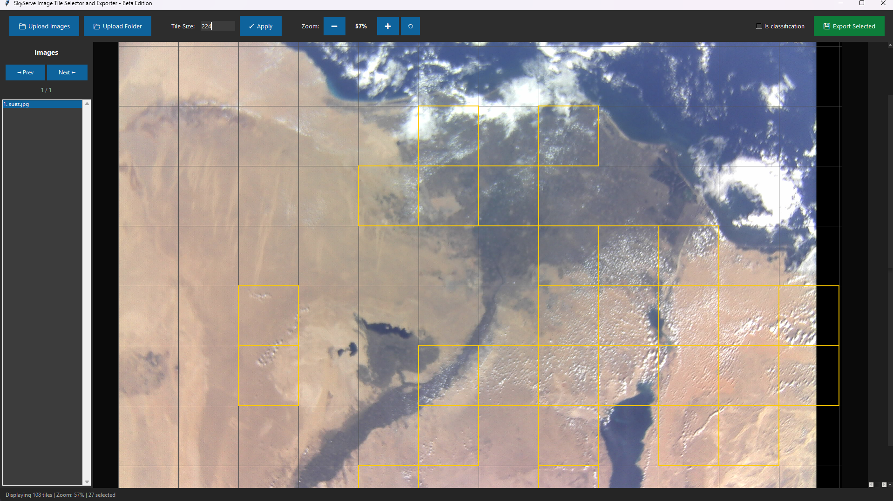
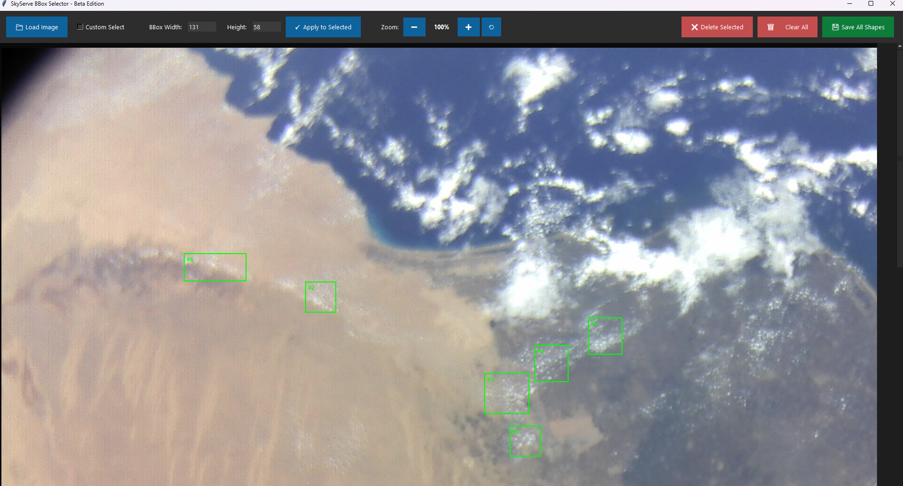

# Image Tile Selector & BBox Annotator

A professional desktop application for image annotation, tile selection, and object detection labeling. Built with Python and Tkinter.

## Features

### Image Tile Selector
- 📁 Load multiple images (PNG, JPG, JPEG, TIFF)
- 🔲 Automatic tile grid generation with customizable size
- ✅ Interactive tile selection/deselection
- 🖱️ Drag selection for multiple tiles (free-style painting)
- 🎯 Classification mode for labeled exports
- 💾 Export selected tiles as individual images
- 🔍 Zoom and pan controls
- 📊 Real-time selection statistics

### BBox Selector & Polygon Annotator
- 📦 Create rectangular bounding boxes
- 🔺 Draw custom polygon selections
- ✏️ Resize bboxes with drag handles
- 🎨 Visual feedback (hover, selection states)
- 🗑️ Delete and clear operations
- 💾 Export annotations as JSON + PNG images
- ⌨️ Keyboard shortcuts for efficiency

## Screenshots
### Image Tile Selector


### Image BBox Selector


## Installation

### Prerequisites
- Python 3.7 or higher
- pip package manager

### Setup

1. **Clone the repository**
```bash
git clone https://github.com/vijaypurohit322/Tile-Selector-and-Exporter.git                      
cd Tile-Selector-and-Exporter
```

2. **Create a virtual environment (recommended)**
```bash
# Windows
python -m venv venv
venv\Scripts\activate

# Linux/Mac
python3 -m venv venv
source venv/bin/activate
```

3. **Install dependencies**
```bash
pip install -r requirements.txt
```

## Usage

### Running the Application

**Image Tile Selector:**
```bash
python run_tile_selector.py
```

**BBox Selector:**
```bash
python run_bbox_selector.py
```

### Image Tile Selector Workflow

1. **Load Images**
   - Click "📁 Load Images" to select one or more images
   - Images will be displayed with automatic tile grid overlay

2. **Configure Tiles**
   - Adjust "Tile Size" (default: 100 pixels)
   - Click "Generate Tiles" to recreate grid

3. **Select Tiles**
   - **Single Click**: Click on tiles to select/deselect (green = selected)
   - **Drag Selection**: Click and drag across tiles for free-style multi-selection
     - Drag over unselected tiles to select them
     - Drag over selected tiles to deselect them

4. **Export**
   - **Standard Mode**: Click "💾 Export Selected Tiles"
   - **Classification Mode**: Check "Classification Mode", enter class name, then export
   - Choose output folder
   - Files saved as: `{image_name}_tile_{row}_{col}.png`
   - Classification mode creates: `{class_name}/{image_name}_tile_{row}_{col}.png`

### BBox Selector Workflow

1. **Load Image**
   - Click "📁 Load Image" to select an image

2. **Create Bounding Boxes**
   - Set desired width/height in pixels
   - Click anywhere on image to create bbox
   - Click on bbox to select it (turns golden)
   - Drag corner/edge handles to resize

3. **Create Polygons**
   - Check "Custom Select" checkbox
   - Click to add points (3+ required)
   - Press **Enter** or **Right-click** to complete
   - Press **Escape** to cancel

4. **Save Annotations**
   - Click "💾 Save All Shapes"
   - Choose output folder
   - Exports:
     - Individual PNG images for each shape
     - JSON file with all coordinates

### Keyboard Shortcuts

**BBox Selector:**
- `Delete` / `Backspace` - Delete selected shape
- `Enter` - Complete polygon (in polygon mode)
- `Escape` - Cancel polygon (in polygon mode)
- `Ctrl + Mouse Wheel` - Zoom in/out
- `Shift + Mouse Wheel` - Scroll horizontally
- `Mouse Wheel` - Scroll vertically
- `Middle Mouse Drag` - Pan canvas

**Image Tile Selector:**
- `Ctrl + Mouse Wheel` - Zoom in/out
- `Shift + Mouse Wheel` - Scroll horizontally
- `Mouse Wheel` - Scroll vertically

## Project Structure

```
tile-bbox-exporter/
├── src/
│   ├── __init__.py
│   ├── tile_selector/
│   │   ├── __init__.py
│   │   ├── app.py              # Main application entry point
│   │   ├── ui_components.py    # GUI setup and styling
│   │   ├── image_handler.py    # Image loading and navigation
│   │   ├── tile_manager.py     # Tile generation and export
│   │   └── canvas_handler.py   # Canvas display and zoom
│   └── bbox_selector/
│       ├── __init__.py
│       ├── app.py              # Main application entry point
│       ├── ui_components.py    # GUI setup and styling
│       ├── image_handler.py    # Image loading and navigation
│       ├── shape_manager.py    # BBox/polygon operations
│       ├── canvas_handler.py   # Canvas display and zoom
│       └── mouse_handler.py    # Mouse event handling
├── run_tile_selector.py        # Entry point for Tile Selector
├── run_bbox_selector.py        # Entry point for BBox Selector
├── requirements.txt            # Python dependencies
├── README.md                   # This file
├── .gitignore                  # Git ignore rules
└── LICENSE                     # License file

```

## JSON Export Format

When using "Save All Shapes" in BBox Selector, a JSON file is created:

```json
{
  "image": "example.png",
  "image_width": 1920,
  "image_height": 1080,
  "bboxes": [
    {
      "id": 1,
      "x": 100,
      "y": 200,
      "width": 64,
      "height": 64
    }
  ],
  "polygons": [
    {
      "id": 1,
      "points": [[x1, y1], [x2, y2], [x3, y3], ...]
    }
  ]
}
```

## Dependencies

- **Pillow (PIL)** - Image processing
- **tkinter** - GUI framework (included with Python)

See `requirements.txt` for specific versions.

## Troubleshooting

### Issue: "No module named 'PIL'"
**Solution:** Install Pillow
```bash
pip install Pillow
```

### Issue: "tkinter not found"
**Solution:** Install tkinter (Linux)
```bash
# Ubuntu/Debian
sudo apt-get install python3-tk

# Fedora
sudo dnf install python3-tkinter
```

### Issue: Images not loading
**Solution:** Ensure images are in supported formats (PNG, JPG, JPEG, TIFF)

### Issue: Keyboard shortcuts not working
**Solution:** Click on the canvas to give it focus

## Architecture

### Modular Design

Both applications follow a clean, modular architecture with separation of concerns:

**Design Principles:**
- **Single Responsibility**: Each module handles one specific aspect
- **Separation of Concerns**: UI, business logic, and event handling are separated
- **Maintainability**: Small, focused files (~150-300 lines each)
- **Testability**: Easy to unit test individual components
- **Scalability**: Simple to add new features without affecting existing code

**Module Responsibilities:**

| Module | Purpose |
|--------|---------|
| `app.py` | Application initialization and coordination |
| `ui_components.py` | GUI layout, buttons, and styling |
| `image_handler.py` | Image loading, navigation, and management |
| `shape_manager.py` / `tile_manager.py` | Business logic for annotations/tiles |
| `canvas_handler.py` | Canvas rendering, zoom, and display |
| `mouse_handler.py` | Mouse events and user interactions (BBox only) |

### Recent Improvements

**v2.0.1:**
- ✅ Added drag selection for tiles (free-style painting)
- ✅ Smart selection mode (add/remove based on first tile)

**v2.0.0 Refactor:**
- ✅ Modularized monolithic codebase (1200+ lines → 6 modules)
- ✅ Responsive UI for 13"+ displays
- ✅ Fixed tile selection with position-based detection
- ✅ Fixed zoom centering to maintain viewport
- ✅ Improved code organization and maintainability

## Development

### Running Tests
```bash
# Add when tests are implemented
python -m pytest tests/
```

### Code Style
- Follow PEP 8 guidelines
- Use meaningful variable names
- Add docstrings to functions
- Keep modules focused and under 300 lines

## Contributing

1. Fork the repository
2. Create a feature branch (`git checkout -b feature/amazing-feature`)
3. Commit your changes (`git commit -m 'Add amazing feature'`)
4. Push to the branch (`git push origin feature/amazing-feature`)
5. Open a Pull Request

## License

This project is licensed under the MIT License - see the LICENSE file for details.

## Acknowledgments

- Built with Python and Tkinter
- Image processing powered by Pillow
- Designed for satellite imagery and object detection workflows

## Support

For issues, questions, or contributions, please open an issue on the GitHub repository.

---

**Version:** 2.0.1  <br>
**Last Updated:** October 2025 <br>
**Author:** Vijay Purohit <br>
**Email:** <a href="mailto:vijay@skyserve.ai?">vijay@skyserve.ai</a> or <a href="mailto:vijaypurohit322@gmail.com?">vijaypurohit322@gmail.com</a> 
