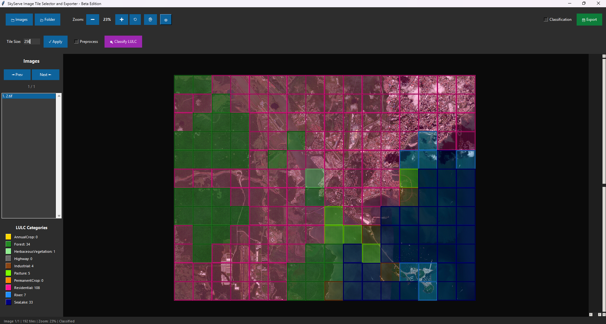
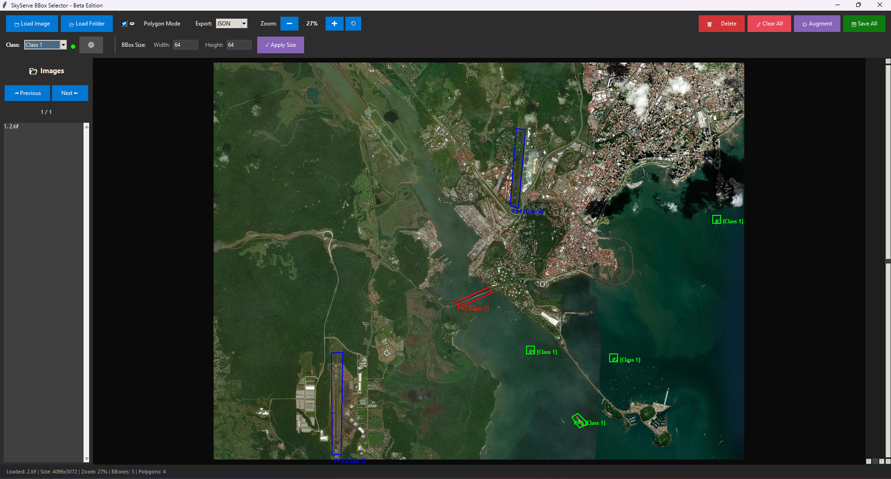

# Image Tile Selector & BBox Annotator

A professional desktop application for image annotation, tile selection, and object detection labeling. Built with Python and Tkinter.

## Features

### Image Tile Selector
- 📁 Load multiple images (PNG, JPG, JPEG, TIFF)
- 🎯 Drag & drop images or folders directly onto canvas
- 🔲 Automatic tile grid generation with customizable size
- ✅ Interactive tile selection/deselection
- 🖱️ Drag selection for multiple tiles (free-style painting)
- 🎯 Classification mode for labeled exports
- 🔍 **LULC Classification** with automated tile categorization
- 🎨 **Image preprocessing** with CLAHE and color correction
- 🌈 **Color-coded overlay** for 10 LULC categories
- 🖐️ **Hand tool** for transparent overlay on hover
- 👁️ **Toggle overlay** visibility
- 📊 **Batch category assignment** for multiple tiles
- 💾 Export tiles to category-specific directories
- 🔍 Zoom and pan controls
- 📊 Real-time selection and classification statistics

### BBox Selector & Polygon Annotator
- 📁 Load single or multiple images
- 🎯 Drag & drop images or folders directly onto canvas
- 📦 Create rectangular bounding boxes
- 🔺 Draw custom polygon selections
- 🏷️ **Multi-class annotation system** with color-coded labels
- 🎨 **Image augmentation** (rotation, flip, brightness, contrast, blur, noise, etc.)
- 📤 **Export formats**: JSON, COCO, Pascal VOC, YOLO
- ✏️ Resize bboxes with drag handles
- 🎨 Visual feedback (hover, selection states)
- 🗑️ Delete and clear operations
- 💾 Export annotations with augmentation support
- ⌨️ Keyboard shortcuts for efficiency
- 🔍 Preserve zoom/pan during annotation

## Screenshots
### Image Tile Selector


### Image BBox Selector


## Installation

### Prerequisites
- Python 3.7 or higher
- pip package manager

### Setup

1. **Clone the repository**
```bash
git clone https://github.com/SkyServe-AI/tile-bbox-exporter.git                      
cd tile-bbox-exporter
```

2. **Create a virtual environment (recommended)**
```bash
# Windows
python -m venv venv
venv\Scripts\activate

# Linux/Mac
python3 -m venv venv
source venv/bin/activate
```

3. **Install dependencies**
```bash
pip install -r requirements.txt
```

## Usage

### Running the Application

**Image Tile Selector:**
```bash
python run_tile_selector.py
```

**BBox Selector:**
```bash
python run_bbox_selector.py
```

### Image Tile Selector Workflow

1. **Load Images**
   - Click "📁 Images" to select one or more images
   - Or click "📂 Folder" to load all images from a directory
   - Or drag & drop images/folders directly onto canvas
   - Images will be displayed with automatic tile grid overlay

2. **Configure Tiles**
   - Adjust "Tile Size" (default: 100 pixels)
   - Click "✓ Apply" to regenerate grid

3. **Enable Preprocessing (Optional)**
   - Check "Preprocess" to apply CLAHE and color correction
   - Canvas will display the preprocessed image
   - Uncheck to revert to original image

4. **Classify Tiles (LULC Mode)**
   - Click "🔍 Classify LULC" to automatically categorize tiles
   - 10 LULC categories: AnnualCrop, Forest, HerbaceousVegetation, Highway, Industrial, Pasture, PermanentCrop, Residential, River, SeaLake
   - Tiles are color-coded by category
   - Category legend shows distribution counts
   - **Single tile adjustment**: Right-click any tile to change its category
   - **Batch assignment**: 
     - Click and drag to select multiple tiles (green checkmarks)
     - Right-click to assign category to all selected tiles
   - **Hand Tool (✋)**: Click to enable hover transparency mode
   - **Toggle Overlay (👁)**: Click to hide/show all category overlays

5. **Export**
   - **Standard Mode**: Click "💾 Export" to save selected tiles
   - **LULC Mode**: Exports tiles to category-specific folders
   - Choose output folder
   - Files saved as: `{image_name}_tile_r{row}_c{col}.png`
   - LULC mode creates: `{category}/{image_name}_tile_r{row}_c{col}.png`

### BBox Selector Workflow

1. **Load Image**
   - Click "📁 Load Image" or "📂 Load Folder" to select images

2. **Select Class** (Multi-Class Annotation)
   - Use class dropdown to select annotation class
   - Click "⚙️ Manage Classes" to add/edit/delete classes
   - Each class has a unique color for visual distinction

3. **Create Bounding Boxes**
   - Set desired width/height in pixels
   - Click anywhere on image to create bbox
   - Click on bbox to select it (turns golden)
   - Drag corner/edge handles to resize
   - Bboxes are color-coded by class

4. **Create Polygons**
   - Check "✏️ Polygon Mode" checkbox
   - Click to add points (3+ required)
   - Press **Enter** or **Right-click** to complete
   - Press **Escape** to cancel
   - Polygons are color-coded by class

5. **Configure Augmentation** (Optional)
   - Click "🎨 Augment" to open settings
   - Enable desired augmentations:
     - Rotation (90°, 180°, 270°)
     - Horizontal/Vertical flip
     - Brightness, Contrast, Blur
     - Noise, Saturation, Sharpness
   - See live count of augmented images per bbox
   - Click "💾 Save Settings"

6. **Select Export Format**
   - Choose format from dropdown: JSON / COCO / VOC / YOLO
   - **JSON**: Individual files per image
   - **COCO**: Single annotations_coco.json
   - **VOC**: XML files in Annotations/ folder
   - **YOLO**: TXT files in labels/ folder + classes.txt

7. **Save Annotations**
   - Click "💾 Save All"
   - Choose whether to apply augmentation
   - Choose output folder
   - Exports:
     - Individual PNG images for each shape
     - Annotations in selected format
     - Augmented versions if enabled

### Keyboard Shortcuts

**BBox Selector:**
- `Delete` / `Backspace` - Delete selected shape
- `Enter` - Complete polygon (in polygon mode)
- `Escape` - Cancel polygon (in polygon mode)
- `Ctrl + Mouse Wheel` - Zoom in/out
- `Shift + Mouse Wheel` - Scroll horizontally
- `Mouse Wheel` - Scroll vertically
- `Middle Mouse Drag` - Pan canvas

**Image Tile Selector:**
- `Ctrl + Mouse Wheel` - Zoom in/out
- `Shift + Mouse Wheel` - Scroll horizontally
- `Mouse Wheel` - Scroll vertically
- `Right Click` - Change tile category (LULC mode)
- `Middle Mouse Drag` - Pan canvas
  - On macOS trackpads use `Control + Click` or two-finger click (Control tap triggers Tk's right-click handler)

## Project Structure

```
tile-bbox-exporter/
├── src/
│   ├── __init__.py
│   ├── tile_selector/
│   │   ├── __init__.py
│   │   ├── app.py              # Main application entry point
│   │   ├── ui_components.py    # GUI setup and styling
│   │   ├── image_handler.py    # Image loading and navigation
│   │   ├── tile_manager.py     # Tile generation and export
│   │   ├── canvas_handler.py   # Canvas display and zoom
│   │   └── lulc_classifier.py  # LULC classification engine
│   └── bbox_selector/
│       ├── __init__.py
│       ├── app.py              # Main application entry point
│       ├── ui_components.py    # GUI setup and styling
│       ├── image_handler.py    # Image loading and navigation
│       ├── shape_manager.py    # BBox/polygon operations
│       ├── canvas_handler.py   # Canvas display and zoom
│       ├── mouse_handler.py    # Mouse event handling
│       ├── augmentation.py     # Image augmentation system
│       └── export_formats.py   # COCO/VOC/YOLO exporters
├── run_tile_selector.py        # Entry point for Tile Selector
├── run_bbox_selector.py        # Entry point for BBox Selector
├── lulc_dataset.py             # LULC dataset generation script
├── requirements.txt            # Python dependencies
├── README.md                   # This file
├── .gitignore                  # Git ignore rules
└── LICENSE                     # License file

```

## Export Formats

### JSON Format
Individual JSON file per image with bbox and polygon annotations:

```json
{
  "image": "example.png",
  "image_width": 1920,
  "image_height": 1080,
  "bboxes": [
    {
      "id": 1,
      "x": 100,
      "y": 200,
      "width": 64,
      "height": 64,
      "class": "Class 1",
      "class_color": "#00ff00"
    }
  ],
  "polygons": [
    {
      "id": 1,
      "points": [[x1, y1], [x2, y2], [x3, y3], ...],
      "class": "Class 1",
      "class_color": "#00ff00"
    }
  ]
}
```

### COCO Format
Single `annotations_coco.json` file compatible with Detectron2, MMDetection:

```json
{
  "images": [{"id": 1, "file_name": "image.jpg", "width": 1920, "height": 1080}],
  "annotations": [
    {
      "id": 1,
      "image_id": 1,
      "category_id": 1,
      "bbox": [100, 200, 64, 64],
      "area": 4096,
      "iscrowd": 0
    }
  ],
  "categories": [{"id": 1, "name": "Class 1", "supercategory": "object"}]
}
```

### Pascal VOC Format
XML files in `Annotations/` folder, compatible with classic object detection models:

```xml
<annotation>
  <filename>image.jpg</filename>
  <size>
    <width>1920</width>
    <height>1080</height>
  </size>
  <object>
    <name>Class 1</name>
    <bndbox>
      <xmin>100</xmin>
      <ymin>200</ymin>
      <xmax>164</xmax>
      <ymax>264</ymax>
    </bndbox>
  </object>
</annotation>
```

### YOLO Format
TXT files in `labels/` folder + `classes.txt`, ready for YOLOv5/v8 training:

```
# Format: <class_id> <x_center> <y_center> <width> <height> (normalized 0-1)
0 0.085417 0.212963 0.033333 0.059259
```

`classes.txt`:
```
Class 1
Class 2
Class 3
```

## Dependencies

- **Pillow (PIL)** - Image processing
- **tkinter** - GUI framework (included with Python)
- **numpy** - Numerical operations for LULC classification
- **opencv-python** - Image preprocessing (CLAHE, color correction)
- **tkinterdnd2** - Drag & drop support (optional)

See `requirements.txt` for specific versions.

## Troubleshooting

### Issue: "No module named 'PIL'"
**Solution:** Install Pillow
```bash
pip install Pillow
```

### Issue: "tkinter not found"
**Solution:** Install tkinter (Linux)
```bash
# Ubuntu/Debian
sudo apt-get install python3-tk

# Fedora
sudo dnf install python3-tkinter
```

### Issue: "No module named '_tkinter'"
**Solution:** macOS Python must be linked against Tcl/Tk. Install the missing frameworks and recreate the virtual environment before reinstalling dependencies.
```bash
# Install the Tcl/Tk runtime (Homebrew example)
brew install tcl-tk

# Point Python to Homebrew's Tcl/Tk when it is rebuilt or installed
# (the python.org installer already bundles Tcl/Tk, so reinstalling from python.org also works)
python3 -m venv venv
source venv/bin/activate
pip install -r requirements.txt

# Confirm tkinter loads
python3 -m tkinter
```

If you use `pyenv`/`asdf`, make sure the build picks up `tcl-tk` headers by exporting `CPPFLAGS`/`LDFLAGS` before compiling.

### Issue: Images not loading
**Solution:** Ensure images are in supported formats (PNG, JPG, JPEG, TIFF)

### Issue: Keyboard shortcuts not working
**Solution:** Click on the canvas to give it focus

## Architecture

### Modular Design

Both applications follow a clean, modular architecture with separation of concerns:

**Design Principles:**
- **Single Responsibility**: Each module handles one specific aspect
- **Separation of Concerns**: UI, business logic, and event handling are separated
- **Maintainability**: Small, focused files (~150-300 lines each)
- **Testability**: Easy to unit test individual components
- **Scalability**: Simple to add new features without affecting existing code

**Module Responsibilities:**

| Module | Purpose |
|--------|---------|
| `app.py` | Application initialization and coordination |
| `ui_components.py` | GUI layout, buttons, and styling |
| `image_handler.py` | Image loading, navigation, and management |
| `shape_manager.py` / `tile_manager.py` | Business logic for annotations/tiles |
| `canvas_handler.py` | Canvas rendering, zoom, and display |
| `mouse_handler.py` | Mouse events and user interactions (BBox only) |


## Development

### Running Tests
```bash
# Add when tests are implemented
python -m pytest tests/
```

### Code Style
- Follow PEP 8 guidelines
- Use meaningful variable names
- Add docstrings to functions
- Keep modules focused and under 300 lines

## Contributing

1. Fork the repository
2. Create a feature branch (`git checkout -b feature/amazing-feature`)
3. Commit your changes (`git commit -m 'Add amazing feature'`)
4. Push to the branch (`git push origin feature/amazing-feature`)
5. Open a Pull Request

## License

This project is licensed under the MIT License - see the LICENSE file for details.

## Acknowledgments

- Built with Python and Tkinter
- Image processing powered by Pillow
- Designed for satellite imagery and object detection workflows

## Support

For issues, questions, or contributions, please open an issue on the GitHub repository.

---

**Version:** 2.2.0  <br>
**Last Updated:** November 2025 <br>
**Author:** Vijay Purohit <br>
**Email:** <a href="mailto:vijay@skyserve.ai?">vijay@skyserve.ai</a> or <a href="mailto:vijaypurohit322@gmail.com?">vijaypurohit322@gmail.com</a> 
